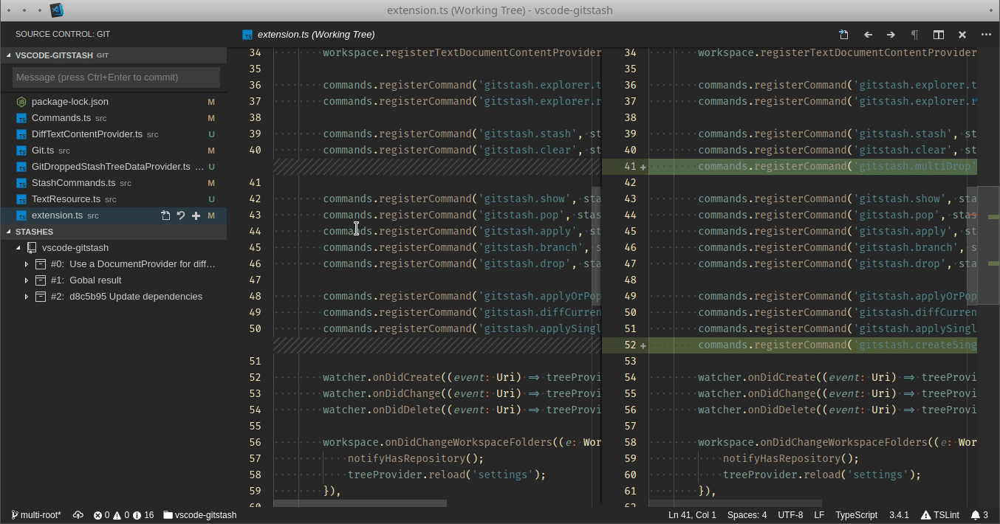
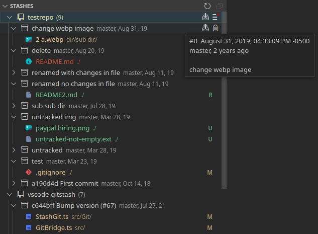
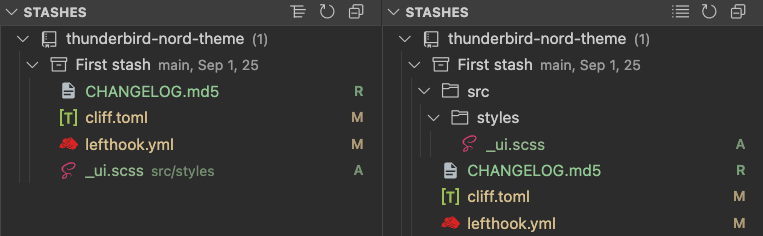
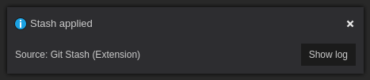
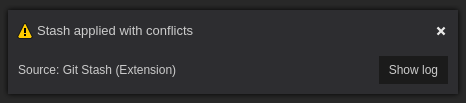
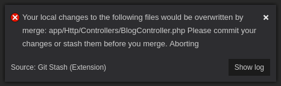
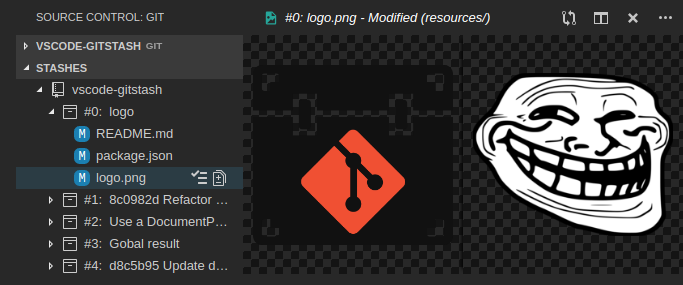
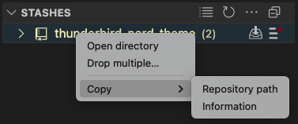
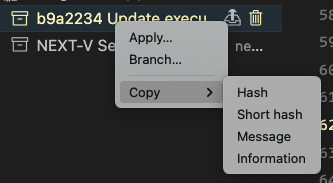
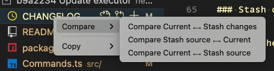

# Git Stash

> Seamlessly integration of git stash functionalities into your editor.

 

 

 
Like the extension? You can support me with a coffee ☕.

## Features

This extension adds a rich set of commands and an interactive explorer tree where you can create, inspect, apply and delete stashes, so managing this data becomes a breeze. It also adds a context menu option on the files listed in the source control view to selectively stash them.
Every executed command is logged along its output for peace of mind.

### Stashes explorer
  - Apply, pop, branch, drop stashes (buttons / context menu)
  - Diff stashed file changes + [alternative diff modes](#diff-view-modes)
  - Apply changes from selected files only
  - Copy stash information like hash, description, etc to clipboard from the context menu
  - Configurable explorer displaying (sorted list or tree)
  - Configurable labels, descriptions, icons, tooltips, decorations, clipboard data
  - Configurable data loading strategy for files (performance related)
  - Open project directory

### Source control explorer
  - Stash selected files... (context menu) To crate a stash only with specified files

### Command palette
You don't need to use the explorer buttons, just type `gitstash` in the command palette. Multi-root supported.
  - gitstash: Stash... For more stashing options
  - gitstash: Apply...
  - gitstash: Branch...
  - gitstash: Clear...
  - gitstash: Drop...
  - gitstash: Drop Multiple...
  - gitstash: Pop...
  - gitstash: Quick switch...
  - gitstash: Quick back...
  - gitstash: Refresh explorer
  - gitstash: Toggle explorer

In a multi-root project, the git repository its automatically inferred from the current open document if there's one.

### Quick Actions

Quick actions automate some tasks by running two or more git commands, sometimes interactively.

 - Quick switch: Save the current branch (session lifetime), stash current changes and checkout the selected branch
 - Quick back: Checkout the previous branch and pop the latest stash

### Installation

Directly available on editors using [VSC Marketplace](https://marketplace.visualstudio.com/items?itemName=arturock.gitstash) and [OpenVSX Registry](https://open-vsx.org/extension/arturock/gitstash). vsix file on [GitHub](https://github.com/artrz/vsx-gitstash/releases).
Releases are [automatically](.github/workflows/release-version.yml) [generated](https://github.com/artrz/vsx-gitstash/actions) 🤖.

### Screenshots

## Diff view modes

### Stash changes ⟷ Current

This is the main diff mode where the stashed changes are compared to the current state of the file.

### Current ⟷ Stash changes

This diff view compares the current state of the file to the staged file, this helps to review how valuable may be the previous (staged) changes considering the latest updates.

### Stash source ⟷ Current

This mode compares the original state of the stashed file before being modified. Being able to compare the staged file before changing can be helpful when the current state of the file has changed in a way that the staged changes don't make much cense anymore.

### Current ⟷ Stash source

Alternative way to diff the stashed file without its changes.

## Commands

| Title            | Command                   | Description
|------------------|---------------------------|------------
| Stash...         | gitstash.stash            | Generate a stash with custom options. Use `stash only` to generate a simple stash. `Staged` is similar to basic git commit except the state is committed to the stash instead of current branch. Use `Keep index` to stash but keep all changes added to the index intact (besides stashing them). Use `Include untracked` if you want to stash also untracked files, leaving the working directory in a very clean state. If you want to stash besides the untracked files, the ignored ones, use the `All` option instead. **WARNING**: Using `Include untracked` (which applies the --include-untracked option) will clean/delete any ignored file, this is not a behavior implemented on the extension but the way some old git versions work.
| Pop...           | gitstash.pop              | Pops a stash w/ or w/o file reindexing, If reindexing selected, every change added to index will be back to that state. this can fail, when you have conflicts (which are stored in the index, where you therefore can no longer apply the changes as they were originally).
| Apply...         | gitstash.apply            | Applies a stash w/ or w/o file reindexing. Reindexing will work the same as Stash Pop with reindex.
| Branch...        | gitstash.branch           | Creates and checks out a new branch starting from the commit at which the stash was originally created, applies the changes recorded in the selected stash to the new working tree and index. If that succeeds the stash will be dropped.
| Drop...          | gitstash.drop             | Drops a stash.
| Clear...         | gitstash.clear            | Removes all the repository stashes.
| Refresh explorer | gitstash.explorer.refresh | Reloads the stash explorer tree.
| Toggle explorer  | gitstash.explorer.toggle  | Shows/hides the stash explorer tree.

## Extension Settings

| Name                                                      | Description |
|-----------------------------------------------------------|-------------|
| `gitstash.explorer.enabled`                               | Shows or hides the explorer on startup |
| `gitstash.explorer.buttons`                               | Shows or hides the explorer tree buttons |
| `gitstash.explorer.eagerLoadStashes`                      | If enabled, stashes will be preloaded instead of lazy loaded. This is required to see the stashes count but may degrade performance if theres too much data |
| `gitstash.explorer.display.emptyRepositories`             | Configures if empty repositories should be listed, hidden or indicate its emptiness. **This setting only applies if stashes are configured to be preloaded** |
| `gitstash.explorer.display.fileSorting`                   | Defines how stash files will be sorted. |
| `gitstash.explorer.items.repository.labelContent`         | Specifies the format for each repository label |
| `gitstash.explorer.items.repository.descriptionContent`   | Specifies the format for each repository description |
| `gitstash.explorer.items.repository.tooltipContent`       | Specifies the format for each repository tooltip |
| `gitstash.explorer.items.repository.to-clipboardContent`  | Specifies repository data to be set on clipboard |
| `gitstash.explorer.items.stash.labelContent`              | Specifies the format for each stash label |
| `gitstash.explorer.items.stash.descriptionContent`        | Specifies the format for each stash description  |
| `gitstash.explorer.items.stash.tooltipContent`            | Specifies the format for each stash tooltip  |
| `gitstash.explorer.items.stash.to-clipboardContent`       | Specifies stash data to be set on clipboard |
| `gitstash.explorer.items.stash.popAndApply`               | Defines if pop or apply will be set as item button |
| `gitstash.explorer.items.stash.diffButton`                | Defines which comparison to display from a file diff button |
| `gitstash.explorer.items.file.decoration`                 | Adds decorations to the tree items |
| `gitstash.explorer.items.file.icons`                      | Defines the icon to show on files |
| `gitstash.explorer.items.file.labelContent`               | Specifies the format for each file label |
| `gitstash.explorer.items.file.descriptionContent`         | Specifies the format for each file description  |
| `gitstash.explorer.items.file.tooltipContent`             | Specifies the format for each file tooltip  |
| `gitstash.explorer.items.file.to-clipboardContent`        | Specifies file data to be set on clipboard |
| `gitstash.explorer.items.renamedFile.labelContent`        | Specifies the format for each renamed file label |
| `gitstash.explorer.items.renamedFile.descriptionContent`  | Specifies the format for each renamed file description  |
| `gitstash.explorer.items.renamedFile.tooltipContent`      | Specifies the format for each renamed file tooltip  |
| `gitstash.explorer.items.renamedFile.to-clipboardContent` | Specifies file data to be set on clipboard |
| `gitstash.editor.diffTitleFormat`                         | Specifies the format for the diff editor title |
| `gitstash.log.autoclear`                                  | Clears the log window before showing the action result |
| `gitstash.notifications.success.show`                     | Shows a notification on a successful execution |
| `gitstash.advanced.repositorySearchDepth`                 | Search depth for finding repositories on subdirectories |
| `gitstash.advanced.ignoredDirectories`                    | Directories to ignore when searching in depth |

## Tips

- Contrary to the git stash command included in VS Code, with `Stash... - Stash only` you can generate a stash even though all your changes are already added to index.
- Use `Stash... - Keep index` if you want to make two or more commits out of the changes in the working tree and you want to isolate features to test each change before committing.
- With `Git Stash` + `Stash Apply...` you can make a backup in case you want to make some cleanup for incomplete features before making a commit.
- You may want to control when to see the stash explorer, to do so add a key binding to execute `gitstash.explorer.toggle` and configure the extension to not to show the stash explorer tree when starting the editor with `gitstash.explorer.enabled`.

## Release Notes

See the [changelog](./CHANGELOG.md).

## Contributing

First of, thanks for your interest in helping out!

There are a set of tool configured to ease development:
 - Git hooks configured via [Lefthook](https://lefthook.dev/)
 - Github PR title linted via [Commitlint](https://commitlint.js.org/)
 - Versioning managed via [cliff-jumper](https://github.com/favware/cliff-jumper)

Lefthook is configured to automatically perform tasks on pre-commit and pre-push hooks.
To install the git hooks in your cloned repo run `npm run prepare`.
This way, [the configured hooks](./lefthook.yml) will be automatically executed.

When creating a PR, the title will be automatically linted with a [github workflow](./.github/workflows/semantic-pull-request.yml)
to ensure it's conformant with the [conventional commit structure](https://www.conventionalcommits.org/en/v1.0.0/).
Failing to comply wont let the PR to merge. This is important because the versioning tool
uses the commit messages to define the version change.

## Testing

Tests are located in `src/test/`. Run `npm test` to execute the test suite.

## Versioning and releasing

Once you're in the main branch with all changes merged and ready to release a new version:

Use `npm run pub:bump` to increment the version and update the changelog and commit the changes. Internally,
`pub:bump` uses cliff-jumper to automatize the process.

To undo a bump, use `npm run pub:debump {generated tag}` which undoes the commit and deletes the tag. E.g.:
`npm run pub:debump v0.5.0`

Finally, run `npm run pub:release` to push the changes along with the new tag.
Pushing the tag will trigger a workflow that creates a new Github release and publishes the new version in the Marketplace and the Open VSX Registry.

## License

See the [license](./LICENSE.md).
